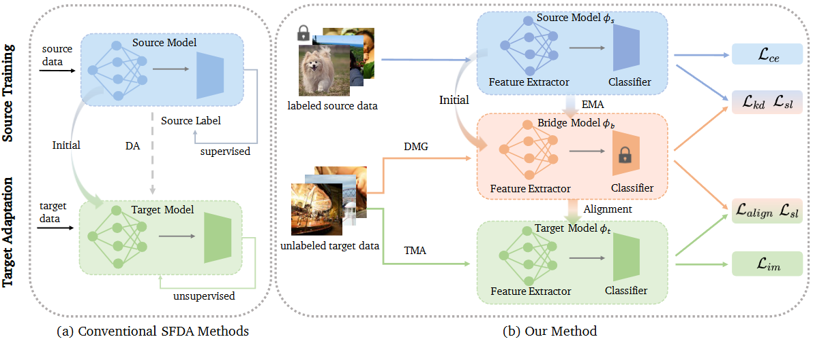

# Bridge then Begin Anew: Generating Target-relevant Intermediate Model for Source-free Visual Emotion Adaptation

> **Bridge then Begin Anew: Generating Target-relevant Intermediate Model for Source-free Visual Emotion Adaptation**<br>
> AAAI 2025<br>

> **Abstract:** 
>
> *Visual emotion recognition (VER), which aims at understanding humans' emotional reactions toward different visual stimuli, has attracted increasing attention. Given the subjective and ambiguous characteristics of emotion, annotating a reliable large-scale dataset is hard. For reducing reliance on data labeling, domain adaptation offers an alternative solution by adapting models trained on labeled source data to unlabeled target data. Conventional domain adaptation methods require access to source data. However, due to privacy concerns, source emotional data may be inaccessible. To address this issue, we propose an unexplored task: source-free domain adaptation (SFDA) for VER, which does not have access to source data during the adaptation process. To achieve this, we propose a novel framework termed Bridge then Begin Anew (BBA), which consists of two steps: domain-bridged model generation (DMG) and target-related model adaptation (TMA). First, the DMG bridges cross-domain gaps by generating an intermediate model, avoiding direct alignment between two VER datasets with significant differences. Then, the TMA begins training the target model anew to fit the target structure, avoiding the influence of source-specific knowledge. Extensive experiments are conducted on six SFDA settings for VER. The results demonstrate the effectiveness of BBA, which achieves remarkable performance gains compared with state-of-the-art SFDA methods and outperforms representative unsupervised domain adaptation approaches.* 

## Table of Contents

- [Introduction](#Introduction)
- [Getting Started](#getting-started)
- [Citation](#Citation)

## Introduction



An overview comparison between conventional SFDA methods (a) and our method (b). In conventional methods (a), the source domain model is directly fine-tuned to align the source and target domains. This direct adaptation approach can be problematic due to significant differences between the source and target domains, potentially leading to suboptimal performance. In contrast, our Bridge then Begin Anew (BBA) approach (b) introduces a bridge model to generate more reliable pseudo-labels and stimulates the exploration of target domain-specific knowledge.

Supplementary materials can be found in [Bridge_then_Begin_Anew_Supplementary Material.pdf](./Bridge_then_Begin_Anew_Supplementary Material.pdf)

## Getting Started

Comming Soon...

## Citation

If you find BBA useful in your research, please consider citing:

```bibtex
TODO
```
